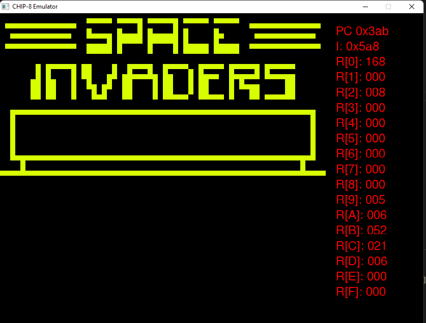

# A simple CHIP-8 Emulator

[CHIP-8 Instructions manual](http://devernay.free.fr/hacks/chip8/C8TECH10.HTM)

___

## Installation
Compiled on windows x64 under Mingw-64, headers and libraries including the required .dlls, roms, fonts have been copied on the project directory, nothing is installed globally
## Running the program

___
## References

___
## TO-DO:
- [ ] Rewrite it using C++
- [ ] Rewrite a copy replacing SDL with OpenGL for graphic display, GLFW for keyboard input and Irrklang for audio sound
- [ ] Rewrite a copy replacing SDL with DirectX 11 for graphic display, keyboard input and audio sound